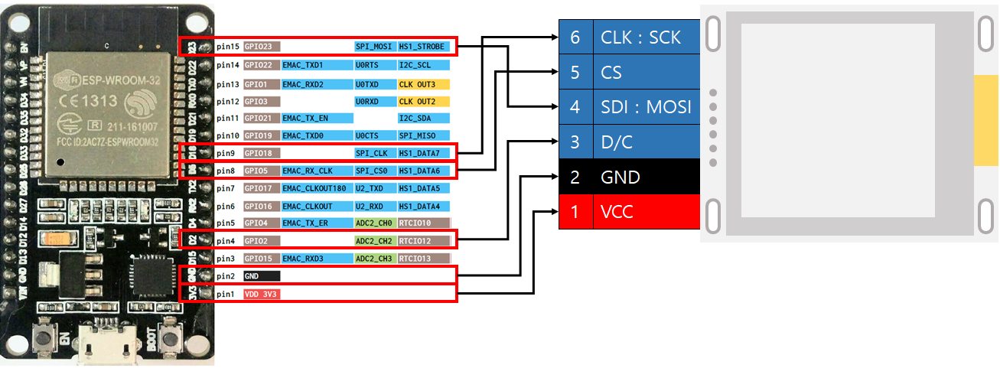

# C++ libraries for Waveshare e-paper series ESP32
C++ libraries for Waveshare e-paper series ESP32
## Changing the original source
This source was originally written by Yehui(soonuse, https://github.com/soonuse).

[Original source](https://github.com/soonuse/epd-library-wiringpi).

For the SPI and GPIO protocols, the epdif.cpp file and the epdif.h file have mainly changed.
## Development environment
  * OS: ESP32
  * Libraries: ESP-IDF
## ESP32 GPIO Pin map 
 

Pin order may vary for different e-ink manufacturers
## Hardware connection (OLED => ESP32)
  * VCC    ->    VDD 3V3
  * GND    ->    GND
  * D/C    ->    GPIO 02
  * SDI    ->    GPIO 23 (SPI_MOSI)
  * CS     ->    GPIO 05 (SPI_CS0)
  * CLK    ->    GPIO 18 (SPI_SLK)

Hardware is E-Ink 1.54(Detailed model name is unknown, It seems to use IL3829.)

## How to use
### based on ESP-IDF
1.  install the ESP-IDF
2.  Set it for the compilation environment.
    <pre>make menuconfig</pre>
3.  compile the file with: 
 ? ?<pre>make</pre>
4.  Flash on the ESP32 board.: 
 ? ?<pre>make flash</pre>

## Supported models
1.54"/1.54"

## Acknowledgments
This source was originally written by Yehui(soonuse, https://github.com/soonuse).

This source has just been changed to be used for ESP32.
I would like to thank Yehui (soonuse).

